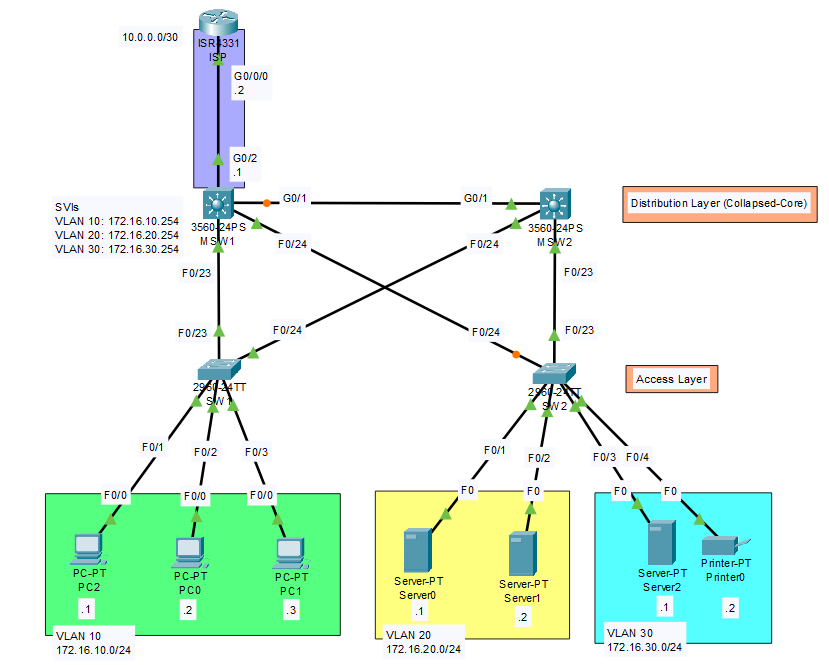
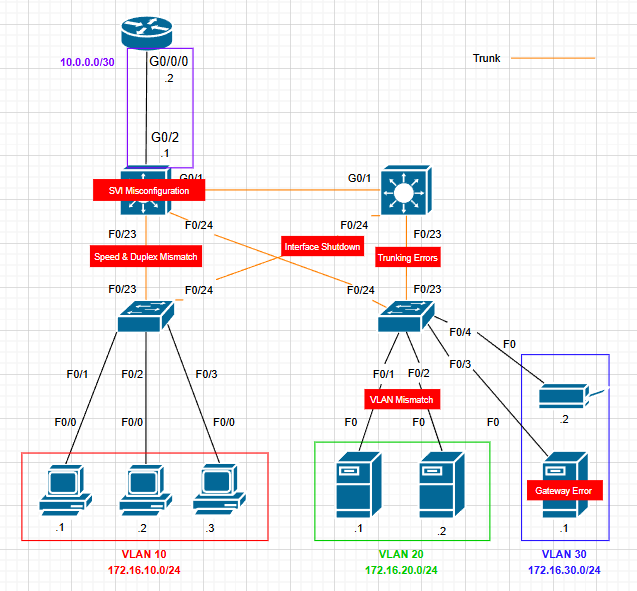

# Network Operations, Monitoring, and Troubleshooting Lab

 

## 📖 Project Overview
The primary objective of this project is to master incident management lifecycles by **intentionally introducing faults** into an Campus-style **Collapsed Core** network topology and systematically resolving them.

The lab focuses on the detection, diagnosis, and resolution of connectivity issues using standard industry protocols and Cisco IOS–style diagnostic commands (implemented in Packet Tracer).

## 🏗️ Network Topology

**Architecture Summary:**
* **Network & End Devices:** 
  *  PCs 
  *  Servers
  *  2 Cisco 2960 switches
  *  2 Cisco 3560-24PS multilayer switches
* **Collapsed Core (Distribution) Layer:** Two Layer 3 switches performing inter-VLAN routing via SVIs and providing a redundant campus aggregation point.
* **Access Layer:** Layer 2 switches connecting end hosts using VLAN segmentation and trunk uplinks.
* **Endpoints:** PCs and servers simulating traffic sources across multiple VLANs.

### **Before going further, please try to do the lab (lab.pkt) to practice troubleshooting.

## ⚡ Simulated Fault Scenarios
To replicate production incidents, the following faults were injected into the network components:

  

### Layer 1: Physical Layer
* **Interface Shutdowns:** Administratively down interfaces on uplinks to simulate cable breaks.
* **Speed and Duplex Mismatch:** Inconsistent speed/duplex settings between Access and Core switches.

### Layer 2: Data Link Layer
* **VLAN Mismatches:** Access ports assigned to incorrect VLANs, isolating hosts from their gateway.
* **Trunking Errors:** Native VLAN mismatches on uplinks and missing "Allowed VLANs" preventing traffic flow to the Core.

### Layer 3: Network Layer
* **Gateway Errors:** End hosts configured with incorrect default gateways (pointing to wrong SVI IP).
* **Routing Logic:** Missing static routes on the Core Switches pointing to external networks or specific subnets.
* **SVI Misconfiguration:** Switched Virtual Interfaces (SVI) configured with incorrect IP masks, causing subnet overlap.

## 🔍 Troubleshooting Methodology
The resolution process followed a strict 4-step diagnostic workflow:

1.  **Symptom Identification:**
    * Used `ping` to test connectivity from Host to Gateway (SVI) and Host to Host.
    * Used `traceroute` to identify where packets stopped routing.
2.  **Information Gathering:**
    * **Layer 1 Check:** `show ip interface brief` (Status/Protocol).
    * **Layer 2 Check:** `show vlan`, `show interfaces trunk`, `show mac address-table`.
    * **Layer 3 Check:** `show ip route` (verifying Core routing table), `show ip interface brief` (verifying SVI status).
3.  **Root Cause Analysis (RCA):**
    * Correlated command output with the topology design to pinpoint configuration drift.
4.  **Resolution & Validation:**
    * Corrected configuration using CLI.
    * Verified fix with repeated `ping` tests and documented results.

## 📝 Incident Log & Resolution
| Fault Type | Symptom | Command Used | Root Cause | Corrective Action |
| :--- | :--- | :--- | :--- | :--- |
| **L1** | Uplink Down | `show ip int brief` | Interface Gi1/0/1 administratively down. | Issued `no shutdown` on interface. |
| **L2** | Intra-VLAN fail | `show vlan` | Port assigned to Default VLAN 1 instead of VLAN 10. | `switchport access vlan 10`. |
| **L2** | Inter-switch fail | `show int trunk` | Native VLAN mismatch (1 vs 99). | Configured `switchport trunk native vlan 99` on both ends. |
| **L3** | Destination Unreachable | `show ip route` | Core Switch missing route to Server subnet. | Added `ip route 192.168.20.0 255.255.255.0 [Next-Hop]`. |